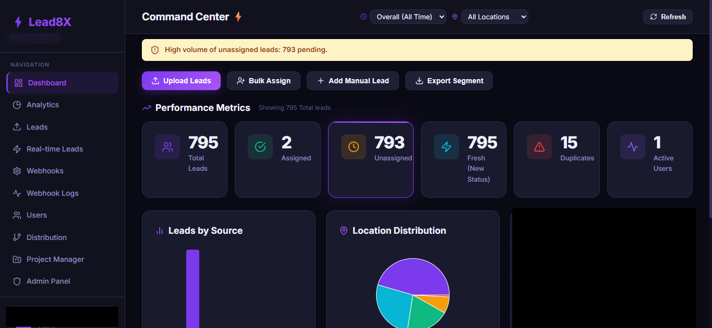
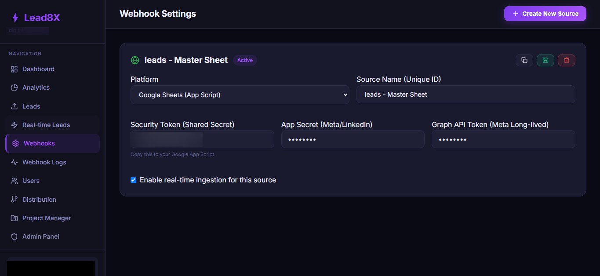
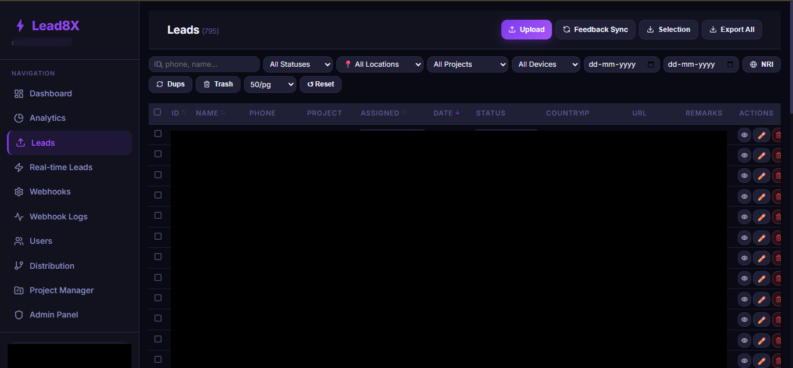

# Lead8X — Enterprise Lead Management System

> **Note:** This is a sanitized portfolio repository showcasing the architecture and codebase of a live production system. Sensitive client data, specific branding, and proprietary API keys have been removed or obfuscated.

## 📖 Project Overview
Lead8X is a custom-built Customer Relationship Management (CRM) and Lead Distribution platform designed for high-volume real estate digital marketing campaigns. 

The system automates the ingestion of leads from multiple social media advertising platforms (Meta/Facebook, LinkedIn), validates the data, securely stores it, and provides an administrative interface for sales teams to manage, export, and analyze lead flow in real-time.

## 🚀 The Problem & Solution
* **The Problem:** The client previously relied on manual daily CSV exports from Facebook and LinkedIn ad managers. This led to delayed response times (often 24+ hours), data entry errors, and lost sales opportunities.
* **The Solution:** I architected a secure, automated backend that listens for real-time webhook payloads from social platforms. Leads are instantly captured, validated, encrypted at rest, and made immediately available to the sales team via the dashboard. Response times were reduced from hours to seconds.

## 🛠️ Tech Stack & Architecture
* **Backend:** PHP (Custom Architecture)
* **Database:** MySQL
* **Frontend:** HTML5, CSS3, JavaScript (Vite build system)
* **Integrations:** Meta Graph API (Webhooks), LinkedIn Marketing Developer Platform
* **Security:** Data Encryption, HMAC Signature Verification

### High-Level Data Flow
1. User submits a Lead Gen form on a Facebook/LinkedIn Ad.
2. Social platform sends a real-time HTTP POST request (Webhook) to the Lead8X backend.
3. Backend (`meta.php` / `linkedin.php`) verifies the payload's cryptographic signature to ensure authenticity.
4. Data is sanitized, validated, and sensitive fields are encrypted.
5. The record is inserted into the MySQL database.
6. Sales team views the new lead instantly on the Lead8X Admin Dashboard.

## ✨ Key Features (Screenshots)

*(Add your screenshots here! Replace the placeholder image links with your actual blurred screenshots in a folder like `/docs/images/`)*

### 1. Real-Time Admin Dashboard
The main interface where the sales team can view, filter, and export leads.
> 

### 2. Webhook Monitoring & Logs
A custom built-in logging system to track successful API payloads and debug connection issues without needing server access.
> 

### 3. Excel Import / Export Engine
Robust functionality built with custom PHP (`ExcelHandler.php`) to allow bulk downloading of filtered leads and uploading of legacy offline records.
> 

## 💻 Technical Highlights

### Secure Webhook Ingestion
To prevent malicious data injection, the system strictly verifies incoming webhooks using HMAC signatures against the app secret before processing any payload.

### Data Integrity & Encryption
Because the system handles Personally Identifiable Information (PII) like phone numbers and emails, sensitive fields are encrypted at rest in the database. I built automated integrity checks (`test_encryption_integrity.php`) to ensure data can always be safely decrypted for authorized users.

### Zero-Downtime Database Migrations
The platform required evolving the database schema (e.g., adding rate limits, restructuring location taxonomies) while live in production. I wrote custom SQL migrations (`20260416_add_rate_limits.sql`, `migrate_locations.php`) to ensure data integrity during schema updates.

---
*Created by Eshwar singh. This project demonstrates advanced backend architecture, third-party API integrations, and data security best practices.*
